### My Palette 🎨

这里是小熠（也可以叫我熠宝、熠仔

无能狂怒/万年打铁ACMer/啥也不会CTFer/退役雀魂选手/在成为打谱人的方向越走越远/前iOSer/正在努力成为Gopher

<!--
**Transmigration-zhou/Transmigration-zhou** is a ✨ _special_ ✨ repository because its `README.md` (this file) appears on your GitHub profile.

Here are some ideas to get you started:

- 🔭 I’m currently working on ...
- 🌱 I’m currently learning ...
- 👯 I’m looking to collaborate on ...
- 🤔 I’m looking for help with ...
- 💬 Ask me about ...
- 📫 How to reach me: ...
- 😄 Pronouns: ...
- ⚡ Fun fact: ...
-->

「花、好きになった？」
「~~いや、嫌いだな~~」

「どうして、剣を振るの？」
「~~俺にはこれしかないからだ~~」

------------
「花は、好き？」
「嫌いじゃなくなった」

「どうして、剣を振るの？」
「お前を守るために」
